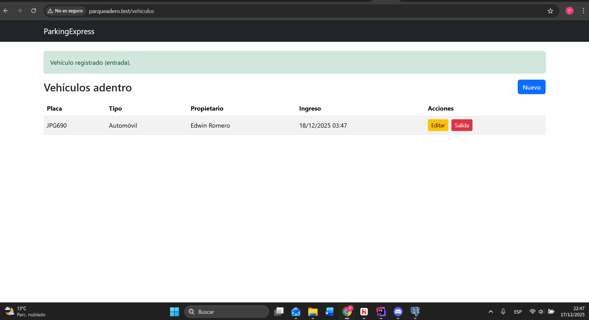

# ParkingExpress - Parqueadero del Centro

Nombre: Daniela Pozo

Fecha: 18/12/2025  

## Decisiones de Diseño

### 1. Tabla
Nombre de la tabla: vehiculos

Campos:
<table>
  <tr>
    <th>Campo</th>
    <th>Tipo</th>
    <th>Obligatorio</th>
  </tr>
  <tr>
    <td>placa</td>
    <td>string</td>
    <td>Sí</td>
  </tr>
  <tr>
    <td>tipo</td>
    <td>string</td>
    <td>Sí</td>
  </tr>
  <tr>
    <td>propietario</td>
    <td>string</td>
    <td>No</td>
  </tr>
  <tr>
    <td>observaciones</td>
    <td>text</td>
    <td>No</td>
  </tr>
  <tr>
    <td>created_at</td>
    <td>timestamp</td>
    <td>Sí</td>
  </tr>
  <tr>
    <td>updated_at</td>
    <td>timestamp</td>
    <td>Sí</td>
  </tr>
</table>

### 2. Tipos de vehículo colocados
- Automóvil
- Motocicleta
- Camioneta

### 3. ¿Se eliminarían los registros?
Al final, no se permite eliminarlos, solo registrar salida.

Razón:
Debería mantenerse no eliminarse y solo registrarse las salidas ya que, como dice el hijo, se desearía mantener un historial de los vehículos que entran y salen. Así que, con el método de marcar salida (salida_at) podemos manetener el historial de entradas , salidas y auditoría.

### 4. Link al github:
https://github.com/DaniellaPR/parqueadero-laravel

### 5. Imágenes esenciales
## Capturas de Pantalla

### Listado de vehículos

### Registro de vehículo

### Vista móvil

#### (Imágenes restantes en directorio de capturas)

